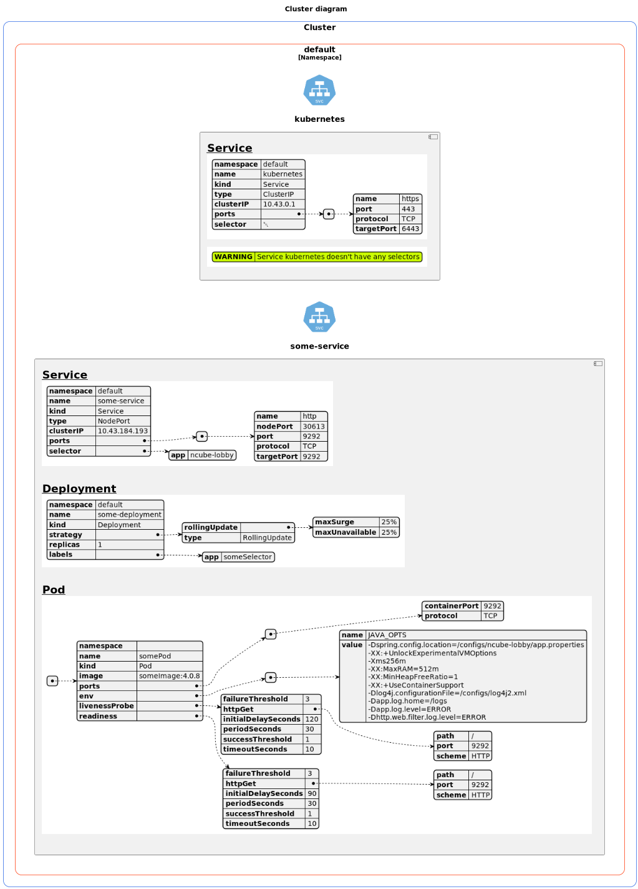

# Scan k8s cluster and generates a schema using PlantUML syntax

#### Requirements:

[**JQ command-line JSON processor**](https://stedolan.github.io/jq/)

[**PlantUML**](https://plantuml.com/)

#### Usage:

`schemagenerator.sh [-c CONFIG] [-n NAMESPACE] [-w MAX_WIDTH]`

##### Available options:

- `-c CONFIG`    - Sets the kubernetes config to be used by kubectl
- `-n NAMESPACE` - Uses a namespace filter.  Default will be used all namespaces
- `-w MAX_WIDTH` - Set max width for the schema.  Default will be used 1980

##### Example:

`schemagenerator.sh -c customconfig.conf -n your-namespace -w 1024`  

##### Result:

